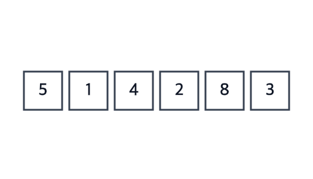

# Bubble Sort

**Ý tưởng:** duyệt mảng từ đầu đến cuối, so sánh **từng cặp kề nhau** `a[j]` và `a[j+1]`, sai thứ tự thì đổi chỗ. Hết một lượt, phần tử lớn nhất "nổi" về cuối mảng (như bọt khí). Lặp lại với phần chưa sắp.



## Ví dụ: `[5, 1, 4, 2, 8]`

**Lượt 1** — duyệt cả mảng:
```
[5, 1, 4, 2, 8]   5 > 1 → đổi
[1, 5, 4, 2, 8]   5 > 4 → đổi
[1, 4, 5, 2, 8]   5 > 2 → đổi
[1, 4, 2, 5, 8]   5 < 8 → giữ
→ [1, 4, 2, 5 | 8]       8 đã đúng chỗ
```

**Lượt 2** — bỏ qua ô cuối:
```
[1, 4, 2, 5 | 8]  1 < 4 → giữ
[1, 4, 2, 5 | 8]  4 > 2 → đổi
[1, 2, 4, 5 | 8]  4 < 5 → giữ
→ [1, 2, 4 | 5, 8]       5 đã đúng chỗ
```

**Lượt 3:**
```
[1, 2, 4 | 5, 8]  1 < 2 → giữ, 2 < 4 → giữ
→ không đổi lần nào → đã sắp xong, dừng
```

## Ghi nhớ
- Mỗi lượt **luôn bắt đầu từ đầu mảng** (`j = 0`), so sánh `a[j]` với `a[j+1]` — đọc thẳng từ mảng, không giữ giá trị trong biến riêng.
- Sau lượt thứ `i` (đếm từ 0), `i + 1` phần tử cuối đã đúng chỗ → vòng trong chỉ cần chạy `j < n - 1 - i`.
- **Bản tối ưu:** thêm cờ `swapped`; cả lượt không đổi lần nào thì dừng sớm → best case O(n).

## Tự kiểm tra
| Câu hỏi | Đáp án | Vì sao |
|---|---|---|
| Best case | **O(n)** | Mảng đã sắp + có cờ `swapped`: 1 lượt rồi dừng. Không có cờ thì vẫn O(n²) |
| Average / Worst | **O(n²)** | Worst là mảng sắp ngược: n−1 lượt, mỗi lượt ~n phép so sánh |
| Bộ nhớ | **O(1)** | Chỉ một biến tạm để đổi chỗ |
| Stable? | **Có** | Chỉ đổi khi `a[j] > a[j+1]` (không phải `>=`) nên phần tử bằng nhau giữ nguyên thứ tự |
| In-place? | **Có** | Sắp ngay trên mảng gốc |

## Bẫy hay gặp
- Dùng `>=` thay cho `>` → mất tính stable.
- Quên cờ `swapped` → best case thành O(n²).
- Vòng trong bắt đầu từ `i + 1` (giống Selection Sort) → mỗi lượt bỏ qua đầu mảng, phần tử nhỏ ở đầu không bao giờ được xét lại. Ví dụ `[3, 2, 1]` cho ra `[2, 1, 3]`.
- Lưu `a[i]` vào biến (`cur`) rồi so sánh mãi với biến đó → khi không đổi chỗ, `cur` không còn là phần tử đang "nổi", lần đổi sau ghi đè sai và **mất phần tử**. Ví dụ `[3, 5, 1]` cho ra `[3, 1, 3]`.
- Vòng trong chạy tới `j < n` → `a[j+1]` đọc ra ngoài mảng (`undefined` trong JS).

## So với Insertion Sort
Cả hai đều O(n²), nhưng Bubble Sort đổi chỗ nhiều hơn hẳn (mỗi lần đổi 3 phép gán, Insertion chỉ dịch 1 phép gán) nên thực tế gần như không ai dùng Bubble Sort.

## Luyện thêm
LeetCode 283 (Move Zeroes).
