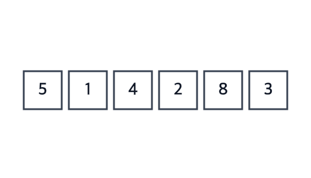

# Insertion Sort

**Ý tưởng:** như xếp bài trên tay — rút từng lá (`key`), **dịch** các lá lớn hơn nó trong phần đã sắp sang phải một ô, rồi **chèn** `key` vào chỗ trống. Phần đã sắp nằm bên trái và lớn dần.



Trong GIF, `key` được nhấc lên và lơ lửng trên ô trống (viền đứt); mũi tên chỉ vào `a[j]` đang so với `key`; mỗi lần dịch, ô trống lùi sang trái một ô.

## Ví dụ: `[5, 1, 4, 2, 8]`

Lúc đầu phần đã sắp chỉ có `[5]`. Dấu `_` là ô trống (giá trị đã nằm an toàn trong `key`).

**`i = 1`, key = 1:**
```
[5, _, 4, 2, 8]   5 > 1 → dịch 5
[_, 5, 4, 2, 8]   hết mảng → chèn 1 vào ô 0
[1, 5 | 4, 2, 8]
```

**`i = 2`, key = 4:**
```
[1, 5, _, 2, 8]   5 > 4 → dịch 5
[1, _, 5, 2, 8]   1 < 4 → dừng, chèn vào ô 1
[1, 4, 5 | 2, 8]
```

**`i = 3`, key = 2:**
```
[1, 4, 5, _, 8]   5 > 2 → dịch 5
[1, 4, _, 5, 8]   4 > 2 → dịch 4
[1, _, 4, 5, 8]   1 < 2 → dừng, chèn vào ô 1
[1, 2, 4, 5 | 8]
```

**`i = 4`, key = 8:** `5 < 8` → dừng ngay, 8 giữ nguyên chỗ. Xong.

## Ghi nhớ
- **Lưu `key = a[i]` trước** — ô `i` coi như trống; mảng không dài thêm, ô trống chỉ lùi dần sang trái.
- **Dịch, không đổi chỗ:** trong vòng lặp chỉ `a[j + 1] = a[j]` (1 phép gán); `key` ghi **một lần** sau vòng lặp, vào `a[j + 1]`.
- **Dừng ngay khi `a[j] <= key`** → mảng đã sắp chỉ tốn 1 so sánh mỗi phần tử → best case O(n).
- Cần `j` sau vòng lặp → khai báo `let j;` **ngoài** vòng `for`.

## Tự kiểm tra
| Câu hỏi | Đáp án | Vì sao |
|---|---|---|
| Best | **O(n)** | Mảng đã sắp: mỗi key so 1 lần rồi dừng |
| Avg / Worst | **O(n²)** | Worst là mảng sắp ngược: key nào cũng dịch về tận đầu |
| Bộ nhớ | **O(1)** | Chỉ thêm biến `key` |
| Stable? | **Có** | Chỉ dịch khi `a[j] > key` (không phải `>=`) nên phần tử bằng nhau không vượt nhau |
| In-place? | **Có** | Sắp ngay trên mảng gốc |
| Dùng khi nào | **Mảng nhỏ / gần sắp** | Chi phí tỉ lệ số cặp sai thứ tự; Timsort (`sort` của JS) và introsort chuyển sang Insertion cho đoạn nhỏ |

## Bẫy hay gặp
- **Quên lưu `key`** → phép dịch đầu tiên ghi đè mất giá trị cần chèn.
- **Không `break` khi `a[j] <= key`** → kết quả vẫn đúng nhưng best case thành O(n²).
- **Ghi `key` trong mỗi bước** (`a[j + 1] = a[j]; a[j] = key;`) → thành đổi chỗ lùi từng ô như Bubble, mất lợi thế 1 phép gán mỗi bước.
- **Chèn vào `a[j]` thay vì `a[j + 1]`.**
- Điều kiện phải là `j >= 0 && a[j] > key` — đảo thứ tự sẽ đọc `a[-1]` (`undefined` trong JS, chạy sai mà không báo lỗi).

## So với Bubble và Selection
| | Bubble | Selection | Insertion |
|---|---|---|---|
| Best | O(n) | O(n²) | O(n) |
| Stable | Có | Không | Có |
| Mỗi bước di chuyển | Đổi chỗ (3 gán) | Đổi 1 lần/lượt | Dịch (1 gán) |

Insertion thường nhanh nhất trong ba thuật toán O(n²) trên thực tế.

## Luyện thêm
LeetCode 147 (Insertion Sort List).
