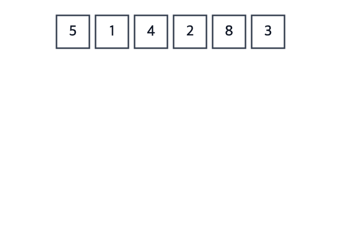

# Merge Sort

**Ý tưởng:** **chia đôi** mảng, **sắp từng nửa** (bằng chính Merge Sort — đệ quy), rồi **trộn** hai nửa đã sắp thành một.



GIF vẽ đúng cây đệ quy, mỗi tầng là một hàng: **chia đi xuống, trộn đi lên.** Nhóm cha mờ đi khi đang chờ hai nhóm con. Nhánh trái được chia và trộn xong hết rồi mới tới nhánh phải — đúng thứ tự đệ quy chạy. Khi trộn, mũi tên chỉ hai con trỏ ở hàng con, ô nhỏ hơn bay lên hàng cha.

## Đệ quy trong 30 giây
Hàm gọi lại chính nó trên bài toán **nhỏ hơn**. Luôn cần 2 phần:
1. **Điểm dừng:** mảng 0 hoặc 1 phần tử thì đã sắp → trả về luôn.
2. **Bước đệ quy:** sắp nửa trái, sắp nửa phải, trộn lại.

Mẹo: **tin là lời gọi đệ quy đã làm đúng.** Viết `mergeSort(left)` thì coi như nửa trái đã sắp xong, chỉ cần lo viết bước trộn.

## Ví dụ: `[5, 1, 4, 2, 8, 3]`

**Chia** đến khi mỗi phần còn 1 phần tử:
```
            [5, 1, 4, 2, 8, 3]
           /                  \
      [5, 1, 4]            [2, 8, 3]
      /       \            /       \
    [5]     [1, 4]       [2]     [8, 3]
            /    \               /    \
          [1]    [4]           [8]    [3]
```

**Trộn** từ dưới lên — mỗi dòng là **một lần gọi `merge`**, thứ tự do đệ quy quyết định:
```
merge([1], [4])             → [1, 4]
merge([5], [1, 4])          → [1, 4, 5]
merge([8], [3])             → [3, 8]
merge([2], [3, 8])          → [2, 3, 8]
merge([1, 4, 5], [2, 3, 8]) → [1, 2, 3, 4, 5, 8]
```

**Bên trong một lần `merge`** — hai con trỏ ở đầu hai mảng, mỗi lần lấy phần tử nhỏ hơn:
```
Trái [1, 4, 5]   Phải [2, 3, 8]
 1 vs 2 → lấy 1   [1]
 4 vs 2 → lấy 2   [1, 2]
 4 vs 3 → lấy 3   [1, 2, 3]
 4 vs 8 → lấy 4   [1, 2, 3, 4]
 5 vs 8 → lấy 5   [1, 2, 3, 4, 5]
 Trái hết → chép nốt Phải: [1, 2, 3, 4, 5, 8]
```

## Ghi nhớ
- **Hai hàm, hai việc:**
  - `mergeSort(array)` — chia đôi bằng `slice`, gọi đệ quy, trả về `merge(...)` của hai nửa.
  - `merge(left, right)` — nhận hai mảng **đã sắp**, trả về một mảng mới. Không biết gì về đệ quy.
- **Chia bằng `slice(0, mid)` và `slice(mid)`** với `mid = Math.floor(n / 2)` — `slice` lấy đến **trước** `end`, nên chia khít, không cần `mid + 1`.
- **Một bên hết thì chép nốt bên kia** (`result.push(...left.slice(i), ...right.slice(j))`).
- **Bằng nhau lấy bên trái** (`<=`) → stable.

## Tự kiểm tra
| Câu hỏi | Đáp án | Vì sao |
|---|---|---|
| Best / Avg / Worst | **O(n log n)** cả ba | Luôn chia đủ log₂ n tầng, mỗi tầng trộn n phần tử — mảng đã sắp cũng vậy |
| Bộ nhớ | **O(n)** | Bước trộn tạo mảng mới |
| Stable? | **Có** | Bằng nhau lấy bên trái (`<=`) |
| In-place? | **Không** | Cần mảng phụ O(n) |

Vì sao là n log n và log là gì: xem [complexity.md](complexity.md).

## Bẫy hay gặp
- **Thiếu / sai điểm dừng** → đệ quy mãi → `Maximum call stack size exceeded`.
- **Chia bằng `slice(0, mid + 1)`** → với n = 2 nửa trái vẫn là cả mảng → đệ quy vô hạn. Đừng vá bằng trường hợp đặc biệt; bỏ `+ 1` là đúng.
- **Quên chép phần còn lại** sau khi một bên hết.
- **Dùng `<` thay `<=`** → mất stable.

## Biến thể dùng chỉ số
Code thư viện thường không `slice` mà truyền `mergeSort(array, left, right)` và `merge(array, left, mid, right)`: hai nửa là hai đoạn liền nhau `[left..mid]` và `[mid+1..right]` trong cùng một mảng (nên `merge` cần `mid` để biết chỗ cắt), trộn vào mảng tạm rồi chép lại. Ít tạo mảng hơn nhưng dễ lệch chỉ số.

## Luyện thêm
LeetCode 88 (Merge Sorted Array), 21 (Merge Two Sorted Lists).
