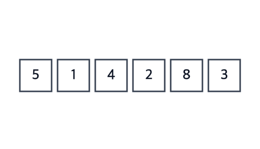

# Quick Sort

**Ý tưởng:** chọn một phần tử làm **mốc** (pivot), xếp lại để **nhỏ hơn mốc sang trái, lớn hơn sang phải, mốc đứng giữa** — lúc này mốc đã đúng chỗ vĩnh viễn. Làm lại y hệt cho nhóm trái và nhóm phải.



Màu trong GIF:
- **Xanh dương** — mốc của nhóm đang xếp.
- **Mũi tên cam `j`** — "thầy" đang hỏi phần tử này.
- **Tam giác tím `i`** — "viên phấn": chỗ phần tử nhỏ tiếp theo sẽ vào.
- **Xanh lá** — mốc đã về đúng chỗ vĩnh viễn.
- **Mờ** — ngoài nhóm đang xếp.

## Ví dụ đời thường: xếp học sinh theo chiều cao

Hàng lộn xộn: `150 120 140 125 170 130`

1. **Chọn mốc:** bạn đứng cuối (130) — chỉ vì tiện, chọn ai cũng được.
2. **"Ai thấp hơn 130 sang trái, cao hơn sang phải":** `120 125 [130] 150 140 170`. Hai bên còn lộn xộn, nhưng **bạn 130 đã đúng chỗ vĩnh viễn** — bên trái đúng 2 bạn thấp hơn, nên khi xếp xong bạn ấy chắc chắn đứng thứ 3.
3. **Làm lại y hệt cho từng nhóm** đến khi mỗi nhóm còn 1 người:
   - `120 125` → mốc 125 → `120 [125]`
   - `150 140 170` → mốc 170 → `150 140 [170]` → nhóm `150 140` → mốc 140 → `[140] 150`

Kết quả: `120 125 130 140 150 170`.

## Lomuto: làm bước 2 khi chỉ được đổi ghế

Mảng như hàng ghế cố định — không ai được rời hàng, chỉ **hai bạn đổi ghế cho nhau**. Thầy dùng:
- **Viên phấn (`i`)** đánh dấu ghế cho bạn thấp tiếp theo, bắt đầu ở ghế đầu nhóm.
- **Thầy (`j`)** đi từ ghế đầu đến ghế ngay trước bạn mốc, hỏi từng bạn "thấp hơn mốc không?":
  - **Cao hơn** → bỏ qua.
  - **Thấp hơn** → đổi ghế với bạn ở ghế phấn, dời phấn sang ghế kế.
- **Cuối cùng:** bạn mốc đổi ghế với bạn ở ghế phấn.

```
ghế:  0    1    2    3    4  | 5
      150  120  140  125  170 | 130 (mốc)     phấn ở ghế 0
ghế 0: 150 cao → bỏ qua
ghế 1: 120 thấp → đổi với ghế 0  → 120 150 140 125 170 | 130   phấn → ghế 1
ghế 2: 140 cao → bỏ qua
ghế 3: 125 thấp → đổi với ghế 1  → 120 125 140 150 170 | 130   phấn → ghế 2
ghế 4: 170 cao → bỏ qua
mốc đổi với ghế phấn (ghế 2)     → 120 125 [130] 150 170 140
```

**Vì sao đổi với ghế phấn không làm hỏng gì?** Bạn ở ghế phấn luôn là một bạn cao đã được bỏ qua — bị đẩy ra sau thì vẫn ở trong nhóm cao. Nhóm cao còn lộn xộn cũng không sao, lượt sau sẽ xếp.

## Bốn biến trong code
| Biến | Trong ví dụ | Ý nghĩa |
|---|---|---|
| `lo` | Ghế đầu của nhóm đang xếp | Nhóm con vẫn ngồi trên cùng hàng ghế, nên phải nói rõ nhóm từ đâu… |
| `hi` | Ghế cuối của nhóm (chỗ bạn mốc) | …đến đâu. `pivot = a[hi]` |
| `j` | Thầy | Đi từ `lo` đến `hi - 1` |
| `i` | Viên phấn | Bắt đầu ở **`lo`** (không phải 0), chỉ tiến khi gặp bạn thấp |

`partition` trả về `i` — ghế cuối cùng của bạn mốc. `quickSort` gọi lại chính nó cho `[lo .. i-1]` và `[i+1 .. hi]` — **bỏ qua bạn mốc** vì bạn ấy đã đúng chỗ.

## Ghi nhớ
- Pivot **bắt đầu** ở cuối nhóm nhưng **kết thúc** ở giữa — "lấy phần tử cuối" chỉ là cách chọn mốc.
- Sau mỗi lần `partition`, mốc đúng chỗ vĩnh viễn → đệ quy hai bên **không tính mốc**.
- **Chọn mốc ngẫu nhiên** rồi đổi nó về cuối nhóm, phần còn lại giữ nguyên Lomuto.
- So với Merge Sort: Merge chia dễ, gộp tốn công; Quick phân hoạch tốn công, gộp không cần làm gì.

## Vì sao cần mốc ngẫu nhiên
Mốc luôn là bạn cuối + hàng **đã xếp sẵn** → mốc luôn là bạn cao nhất → mỗi lượt nhóm chỉ bớt đúng 1 người.

Đo thật với code trong repo (mảng đã sắp):

| Số phần tử | Mốc cố định ở cuối | Mốc ngẫu nhiên |
|---|---|---|
| 10.000 | 79 ms | 2 ms |
| 20.000 | `Maximum call stack size exceeded` | 1 ms |
| 1.000.000 | — | 54 ms |

## Tự kiểm tra
| Câu hỏi | Đáp án | Vì sao |
|---|---|---|
| Best / Avg | **O(n log n)** | Mốc chia nhóm tương đối đều → ~log n tầng, mỗi tầng phân hoạch n phần tử |
| Worst | **O(n²)** | Mốc luôn là nhỏ nhất/lớn nhất (vd mảng đã sắp + mốc cố định ở cuối) |
| Tránh worst | **Mốc ngẫu nhiên** | Hoặc trung vị của đầu/giữa/cuối |
| Bộ nhớ | **O(log n)** | Không mảng phụ, chỉ stack đệ quy (worst O(n)) |
| Stable? | **Không** | Đổi ghế xa làm phần tử bằng nhau đảo thứ tự |
| In-place? | **Có** | Phân hoạch ngay trên mảng gốc |
| Vì sao thực tế nhanh hơn Merge? | In-place, không tạo mảng phụ; duyệt tuần tự nên tận dụng tốt cache CPU | |

Vì sao là n log n: xem [complexity.md](complexity.md).

## Bẫy hay gặp
- Thiếu điểm dừng `if (lo >= hi) return`.
- Đệ quy tính cả mốc (`[lo .. p]`) → có thể đệ quy vô hạn.
- `i = 0` thay vì `i = lo` → sai với nhóm không bắt đầu từ ghế 0.
- Quên bước cuối: đổi mốc về ghế phấn.
- `j` chạy tới `hi` → so mốc với chính nó.
- Đặt cùng tên `pivot` cho cả **vị trí** (trong `quickSort`) lẫn **giá trị** (trong `partition`) → đọc lại dễ nhầm; dùng `pivotIndex`.

## Luyện thêm
LeetCode 75 (Sort Colors — phân hoạch 3 vùng), 215 (Kth Largest Element — quickselect: chỉ đệ quy vào một bên).
