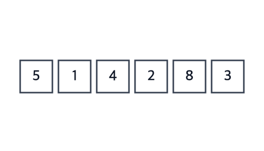

# Selection Sort

**Ý tưởng:** mỗi lượt **tìm phần tử nhỏ nhất** trong phần chưa sắp, rồi **đổi nó về đầu** phần đó. Phần đã sắp lớn dần từ trái sang phải.



Trong GIF, mũi tên chỉ vào `a[j]` và `a[minIndex]` đang so sánh; trước mỗi lần đổi chỗ, mũi tên chỉ vào `a[i]` và `a[minIndex]` sắp đổi.

## Ví dụ: `[5, 1, 4, 2, 8]`

**Lượt 1** — `i = 0`, tìm min trong `[5, 1, 4, 2, 8]`:
```
minIndex = 0 (5)
1 < 5 → minIndex = 1
4 > 1 → giữ
2 > 1 → giữ
8 > 1 → giữ
→ đổi a[0] với a[1]:  [1 | 5, 4, 2, 8]
```

**Lượt 2** — `i = 1`, tìm min trong `[5, 4, 2, 8]`:
```
5 → 4 < 5 → 2 < 4 → 8 > 2  →  min là 2 (vị trí 3)
→ đổi a[1] với a[3]:  [1, 2 | 4, 5, 8]
```

**Lượt 3** — min của `[4, 5, 8]` là 4, đã đúng chỗ → không đổi: `[1, 2, 4 | 5, 8]`

**Lượt 4** — min của `[5, 8]` là 5, đã đúng chỗ → không đổi. Phần tử cuối tự đúng → xong.

## Ghi nhớ
- Nhớ **vị trí** min (`minIndex`), không nhớ giá trị — hết lượt phải biết đổi ô nào.
- `minIndex = i`, vòng trong bắt đầu từ `j = i + 1`; vòng ngoài chỉ cần `i < n - 1`.
- **Chỉ đổi một lần, sau khi hết vòng trong.** `if (minIndex !== i)` để bỏ phép đổi thừa.
- **Không dừng sớm được:** một lượt không đổi chỗ không có nghĩa là phần sau đã sắp.

## Tự kiểm tra
| Câu hỏi | Đáp án | Vì sao |
|---|---|---|
| Best / Avg / Worst | **O(n²)** cả ba | Lượt nào cũng phải quét hết phần chưa sắp mới biết min — luôn n(n−1)/2 phép so sánh |
| Bộ nhớ | **O(1)** | Chỉ thêm `minIndex` và một biến tạm |
| Stable? | **Không** | `[2a, 2b, 1]` → đổi `1` với `2a` → `[1, 2b, 2a]`: phép đổi xa làm hai số 2 đảo thứ tự |
| In-place? | **Có** | Sắp ngay trên mảng gốc |
| Điểm mạnh | **Tối đa n−1 lần đổi** | Ít lần ghi nhất trong nhóm O(n²) — hợp khi ghi tốn kém (vd bộ nhớ flash) |

## Bẫy hay gặp
- **Đổi chỗ ngay trong vòng trong** mỗi khi gặp số nhỏ hơn → kết quả vẫn đúng nhưng không còn là Selection Sort, mất điểm mạnh "ít lần đổi".
- Nhớ giá trị min thay vì vị trí → hết lượt không biết đổi ô nào.
- Thêm cờ `swapped` để dừng sớm → sai, xem mục Ghi nhớ.

## So với Bubble Sort
Cùng O(n²), nhưng Bubble đổi chỗ liên tục (phần tử lớn nổi về cuối), còn Selection chỉ quan sát rồi đổi đúng 1 lần mỗi lượt. Bubble stable và dừng sớm được; Selection thì không.

## Luyện thêm
LeetCode 912 (Sort an Array — tự cài để luyện).
